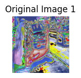
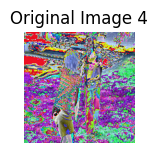
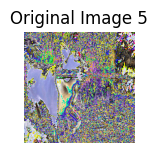
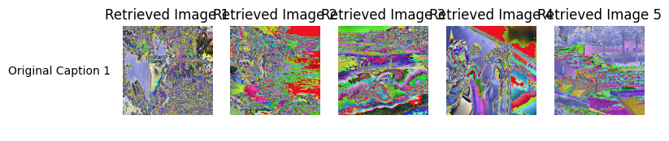

# MultiModel Learning

CLIP Model Evaluation onto the Test Dataset via following metrices R@1, R@5 and R@ for both Image-to-Text and Text-to-Image Retrival.
Please Note that i have trained the model 28 x 1072 images where 28 is the batch size and there are total batches. I have trained the model only for one epochs and also there are some some limitation there fore evaluation of the trained model did't performed well but if we train onto the better quality dataset and tune some training code for better peformance we can get desirable accuracy during training and evaluation time.

Image-to-Text Retrieval:
R@1: 0.0364 : Only 3.6 % is correctly identified out of 10 samples
R@5: 0.1806 : only 18 % correctly identified out of 10 samples
R@10: 0.3538 : Only 35 % correctly identified out of 10 samples.

Text-to-Image Retrieval:
R@1: 0.0358
R@5: 0.1782
R@10: 0.3580

> CLIP Model Predictions for Both tasks Image to Text and Text to Images.

Image-to-Text Retrieval:

Original Image 1:

Top 5 Retrieved Captions:
1: A black and white dog carrying a large stick
2: A boy dressed in soccer attire and holding his shoes getting out of a car .
3: A black dog pounces to get a rope toy .
4: Two young girls playing together .
5: Two young girls are playing and laughing in a green grassy yard .

Original Image 2:

Top 5 Retrieved Captions:
1: A black dog pounces to get a rope toy .
2: A blonde boy wearing a blue life vest and camo shorts jumps off a diveboard into a blue lake .
3: a black dog jumping to catch a rope toy
4: A black and white dog carrying a large stick
5: Two young girls playing together .

Original Image 3:

Top 5 Retrieved Captions:
1: A black and white dog carrying a large stick
2: Two young girls playing together .
3: A blonde boy wearing a blue life vest and camo shorts jumps off a diveboard into a blue lake .
4: A dog trots across the ground with a large stick in his mouth .
5: A boy dressed in soccer attire and holding his shoes getting out of a car .

Original Image 4:

Top 5 Retrieved Captions:
1: A black and white dog carrying a large stick
2: Two young girls playing together .
3: Two children are laughing in the grass .
4: A blonde boy wearing a blue life vest and camo shorts jumps off a diveboard into a blue lake .
5: A black dog pounces to get a rope toy .

Original Image 5:

Top 5 Retrieved Captions:
1: Two young girls playing together .
2: A black and white dog carrying a large stick
3: Two girls standing on grass face each other .
4: A blonde boy wearing a blue life vest and camo shorts jumps off a diveboard into a blue lake .
5: Two children are laughing in the grass .

Text-to-Image Retrieval:

Original Caption 1: A blond woman in a blue shirt appears to wait for a ride .
Top 5 Retrieved Images:

Original Caption 2: A blond woman is on the street hailing a taxi .
Top 5 Retrieved Images:

Original Caption 3: A woman is signaling is to traffic , as seen from behind .
Top 5 Retrieved Images:

Original Caption 4: A woman with blonde hair wearing a blue tube top is waving on the side of the street .
Top 5 Retrieved Images:

Original Caption 5: The woman in the blue dress is holding out her arm at oncoming traffic .
Top 5 Retrieved Images:

## References

1. MultiModel Learning : by Edward Choi Lecture
